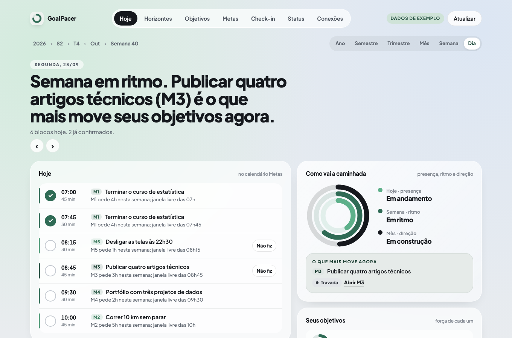
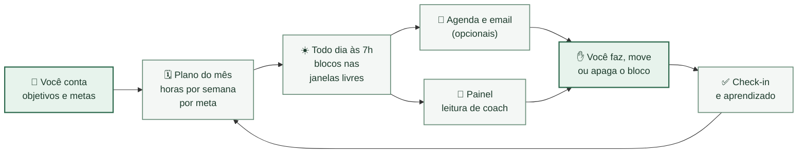
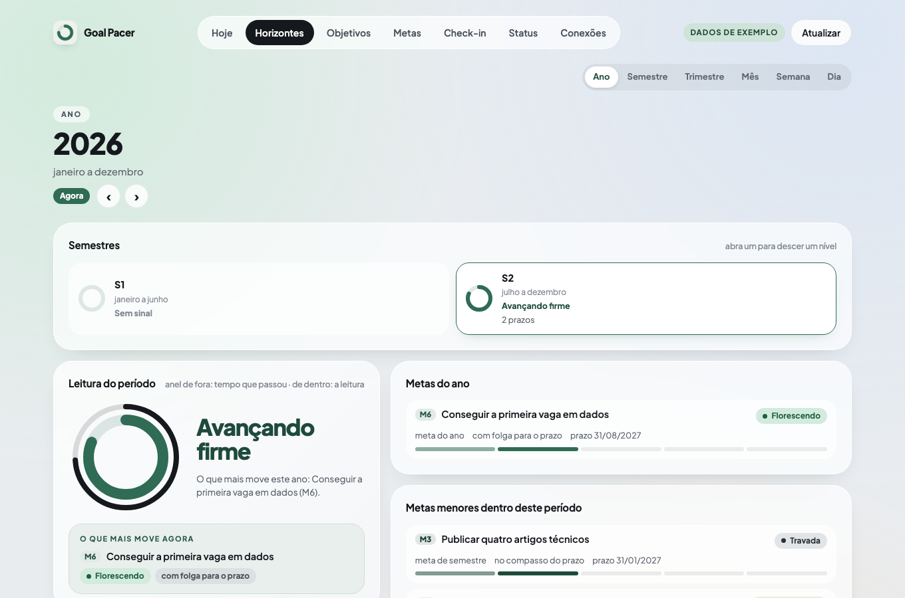
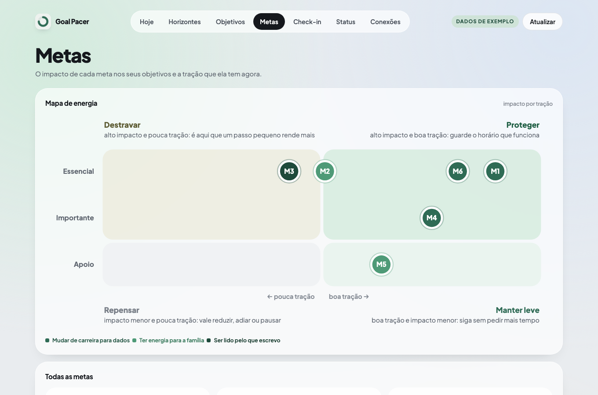
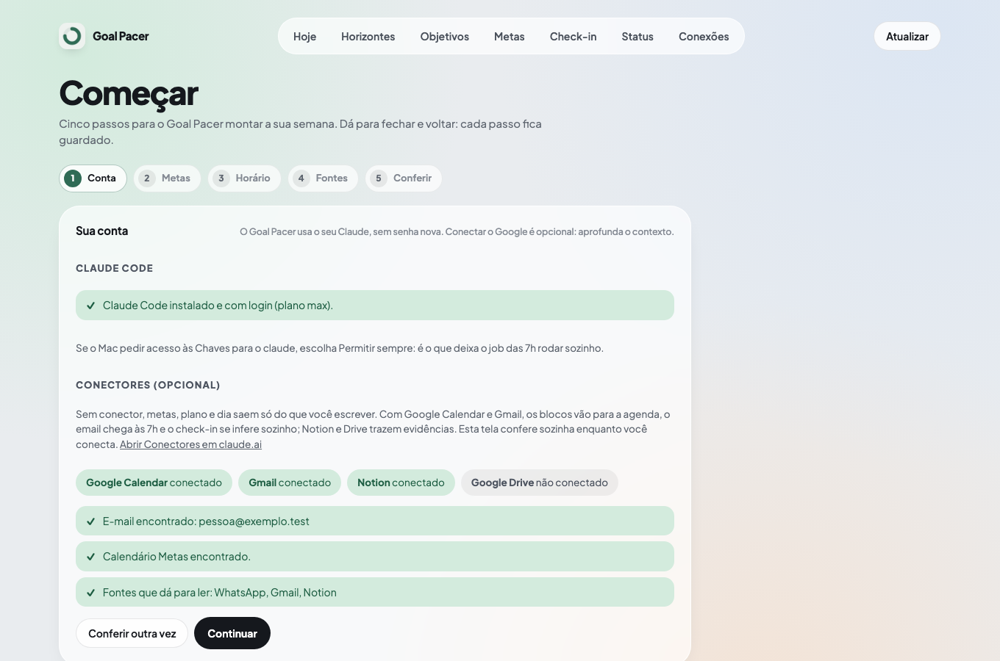
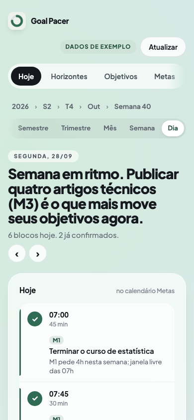
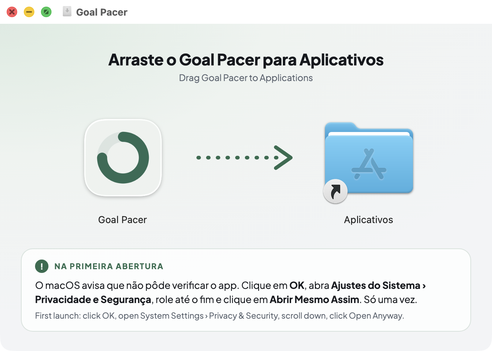

  

<h1 align="center">Goal Pacer</h1>

<strong>Suas metas dos próximos meses viram blocos na sua agenda, todo dia às 7h.</strong> 
  Um coach de metas que roda no seu computador, com a sua assinatura do Claude. Sem servidor, sem chave, sem custo extra.

  
  
  
  
  

  <a href="https://github.com/oasismed/goal-pacer/releases/latest"><strong>⬇️ Baixar para Mac</strong></a>
  &nbsp;·&nbsp;
  <a href="https://github.com/oasismed/goal-pacer/releases/latest"><strong>⬇️ Baixar para Windows</strong></a>

  

## O que é

Você conta o que quer que mude nos próximos meses e as metas que levam até lá. O Goal Pacer calcula quantas horas por semana cada meta pede, confere se a sua agenda tem esse tempo e encaixa blocos nas janelas livres. Todo dia às 7h ele monta o seu dia, e o painel mostra como vão as metas em palavras, como um coach leria, não em porcentagens.

Tudo acontece no seu computador. A inteligência vem do Claude Code que você já usa, pela sua assinatura. Nenhum dado seu vai para um servidor do Goal Pacer, porque ele não tem servidor.

## Como funciona

## O que ele faz

**🎯 Metas que cabem na vida real**
- **Entrevista curta** para registrar objetivos, metas, prazos e o seu horário útil, tudo pela tela Começar
- **Custo de cada meta em horas por semana**, com uma pesquisa que você confirma ou ajusta
- **Plano do mês** com o balanço de horas: o que cabe, o que aperta e a decisão quando não cabe (reduzir, adiar ou manter)

**📅 O dia pronto às 7h**
- **Blocos encaixados** nas janelas livres, dentro do seu horário útil
- **Com o Google Calendar conectado**, os blocos vão para um calendário só dele, chamado Metas, e nunca mexem nos seus outros eventos
- **Com o Gmail conectado**, chega um email curto com os blocos do dia; responder `02 fiz 1h` já faz o check-in

**🧭 Leitura de coach, não placar**
- **Hoje, Horizontes (ano › semestre › trimestre › mês › semana › dia), Objetivos e Metas**, com o estado de cada meta em palavras: florescendo, ganhando ritmo, pede atenção, travada
- **Mapa de energia** que mostra onde proteger o horário e onde um passo pequeno destrava mais
- **Aprende com o que você confirma**: horários que funcionam e quanto cada bloco dura de verdade

**🔒 Seu, de ponta a ponta**
- **Roda no seu computador**, com a sua assinatura do Claude; sem chave de API, senha de app ou conta nova
- **Conectores opcionais**: sem nenhum, o app funciona só com o que você escreve; com Calendar, Gmail, Notion e Drive, ele aprofunda
- **Celular no Wi-Fi de casa**, com código de pareamento e conexão criptografada

## Telas

<table>
  <tr>
    <td width="50%"> <b>Horizontes.</b> Do ano ao dia, cada período com a própria leitura.</td>
    <td width="50%"> <b>Metas.</b> O mapa de energia: proteger, destravar, manter leve ou repensar.</td>
  </tr>
  <tr>
    <td width="50%"> <b>Começar.</b> Confere a conta e os conectores sozinha e guia as metas.</td>
    <td width="50%" align="center"> <b>No celular.</b> O mesmo painel, na tela de início.</td>
  </tr>
</table>

Imagens com dados de exemplo.

## Instalar

**Você precisa de:**
- Um Mac com macOS 13 ou mais novo (Apple Silicon ou Intel) ou um PC com Windows 10 ou 11
- Uma assinatura **Claude Pro ou Max** (sem o Claude Code no computador, a própria tela Começar instala)
- Opcional: Google Calendar e Gmail conectados em [claude.ai](https://claude.ai), para os blocos irem para a agenda e o email chegar às 7h

<table>
  <tr>
    <th width="50%">🍎 Mac</th>
    <th width="50%">🪟 Windows</th>
  </tr>
  <tr>
<td valign="top">

1. Baixe o `Goal-Pacer-X.Y.Z.dmg` na [última versão](https://github.com/oasismed/goal-pacer/releases/latest).
2. Abra o arquivo e arraste **Goal Pacer** para **Aplicativos**.
3. Abra o app. Na primeira vez o macOS avisa que não verificou o app: vá em **Ajustes do Sistema › Privacidade e Segurança** e clique em **Abrir mesmo assim**.
4. O app prepara tudo em cerca de um minuto, com o progresso na janela, e abre na tela **Começar**.

</td>
<td valign="top">

1. Baixe o `Goal-Pacer-Setup-X.Y.Z.exe` na [última versão](https://github.com/oasismed/goal-pacer/releases/latest).
2. Abra o arquivo. Se o Windows avisar que protegeu o computador, clique em **Mais informações › Executar assim mesmo**.
3. A instalação é só para o seu usuário, sem administrador, e cria o atalho **Goal Pacer** no menu Iniciar.
4. No fim, **Abrir o Goal Pacer** leva à tela **Começar**.

</td>
  </tr>
</table>

O aviso da primeira abertura aparece porque o app não tem certificado pago da Apple ou da Microsoft, e só acontece uma vez: as atualizações pelo botão da tela Status não mostram o aviso. Cada versão é assinada e conferida pelo próprio app antes de instalar.

## Primeiros passos

A tela **Começar** faz tudo pela janela do app, sem terminal:

1. **Conta.** Confere o Claude Code. Sem ele, um botão instala; sem login, um botão abre a página do claude.ai e você cola na tela o código que ela mostra no fim.
2. **Conectores (opcional).** Mostra o que está conectado e o link de onde conectar. Se você usar o Google Calendar, crie antes um calendário chamado **Metas**: é o único em que o Goal Pacer escreve.
3. **Metas.** Objetivos, metas, prazos e horas por semana.
4. **Horário.** Quando você costuma ter tempo livre.
5. **Fontes e conferência.** Grava, e o primeiro dia sai na hora.

No Mac, se aparecer um pedido de acesso às Chaves para o `claude`, escolha **Permitir sempre**: é o que deixa o dia sair sozinho às 7h.

## No dia a dia

Na agenda, três gestos bastam:

| Você | O Goal Pacer entende |
|---|---|
| Deixa o bloco onde está | "feita?": aparece com essa marca até você confirmar |
| Apaga o bloco | não feito, sem culpa: o plano se ajusta |
| Move o bloco | reagendado |

Para confirmar sem abrir a agenda, responda o email das 7h com uma linha por bloco, como `02 fiz 1h` ou `03 não fiz`. No painel, a tela **Check-in** faz o mesmo, com uma nota sobre como você está com cada meta.

O computador precisa estar ligado e com a sua sessão aberta. Se estava desligado às 7h, o dia sai assim que você entrar.

## Atualizar e remover

- **Atualizar:** na tela **Status**, **Procurar atualização** baixa a versão mais nova daqui do GitHub, confere a assinatura, faz backup e aplica. A tela avisa sozinha quando há versão nova.
- **Remover:** na tela **Status**, **Remover deste computador**. Suas metas e o histórico ficam guardados na pasta de dados.

## Privacidade

- **Tudo local.** Metas, planos, dias e histórico ficam em `~/.goal-pacer/dados`, no seu computador.
- **Sem segredos.** Nada de chave de API, senha de app ou login próprio: o Goal Pacer usa o Claude Code e os conectores do claude.ai que você já tem.
- **Conteúdo de terceiros é tratado como dado.** Emails, mensagens e convites nunca viram instruções, e nenhuma leitura deles acontece junto com escrita na agenda ou envio de email.
- **Guarda o mínimo.** Eventos fora do calendário Metas perdem título e descrição antes de qualquer uso; leituras temporárias e logs somem em 7 dias.
- **Painel só seu.** Abre só no seu computador; no celular, só com o código de pareamento e conexão criptografada.

## Perguntas frequentes

<b>Preciso conectar Google Calendar e Gmail?</b>

Não. Sem conectores, metas, plano e dia saem do que você escreve e os blocos ficam no painel. Conectar leva os blocos para a agenda, faz o check-in se inferir sozinho e manda o email das 7h.

<b>Quanto custa?</b>

Nada além da sua assinatura Claude Pro ou Max. Um dia usa cerca de 7 mil tokens e o plano do mês cerca de 11 mil.

<b>E se eu não fizer um bloco?</b>

Apague ou mova. O Goal Pacer não cobra: ele refaz a conta da semana e, quando o mês não cabe, sugere reduzir, adiar ou manter.

<b>Funciona em inglês?</b>

Sim. A tela Começar grava o idioma da conversa, e email, painel e notificações saem em português ou em inglês.

<b>Posso usar no celular?</b>

Sim, no mesmo Wi-Fi do computador: na tela Status, o cartão <b>Abrir no celular</b> mostra o endereço e o código. No iPhone, <b>Compartilhar › Adicionar à Tela de Início</b>.

<b>Gosto de terminal. Tem mais?</b>

Tem: o comando `goal-pacer`, a skill `/goal-pacer` no Claude Code, a instalação pelo zip ou pelo git e a configuração avançada estão na [referência](docs/referencia.md).

## Se você viu uma notificação

Cada falha do job traz uma classe e o id da execução (`run_id`). A notificação e o `status` usam os mesmos nomes. O log completo está em `~/.goal-pacer/jobs/logs/run-<run_id>.log`. O email das 7h tenta outra vez até 3 vezes, com 2 minutos entre elas, antes de virar notificação. Quando o Gmail responde, você recebe também um email curto "hoje não gerei o seu dia"; os blocos de ontem continuam valendo.

### SemOnboarding

A pasta de dados está sem metas. Rode `/goal-pacer onboarding`.

### SemMetaAtiva

Todas as metas estão concluídas, vencidas ou arquivadas. Crie uma meta nova em `/goal-pacer onboarding` ou reative uma com `metas.py ajustar M01 --estado ativa`.

### GrafoInvalido

Um arquivo de meta ou o `contexto.md` tem um campo inválido, geralmente depois de uma edição à mão. Rode `goal-pacer validar` e corrija o campo indicado.

### SchemaMismatch

Os arquivos são de outra versão do Goal Pacer. Rode `goal-pacer atualizar`: ele faz o backup, migra os dados com volta atrás automática e confere a versão nova. Se os dados forem mais novos que o app, é o app que precisa da versão nova.

### CacheInvalido

A leitura da agenda voltou num formato inesperado. Rode `/goal-pacer diario`. Se acontecer outra vez, anexe o log da execução a um issue.

### NumerosAlterados

As tabelas do plano mensal foram editadas à mão. Rode `python3 ~/.goal-pacer/app/scripts/balanco.py --render` para refazer os números; a prosa é preservada.

### MetasNaoEncontrado

O calendário Metas não aparece na conta. Crie o calendário no Google Calendar com o nome Metas (ou Goals, numa instalação em inglês) e rode `/goal-pacer onboarding` para gravar o id novo.

### EscopoInsuficiente

O conector respondeu "Insufficient scope": ele lê, mas não escreve. Em claude.ai, desconecte e conecte Google Calendar e Gmail aceitando a permissão de escrita. Confira com `goal-pacer doctor --sondar-escrita`.

### ErroConector

O conector respondeu com erro, geralmente passageiro. Rode `/goal-pacer diario` em alguns minutos.

### ToolNegada

Uma ferramenta foi negada pela configuração do job. Rode `goal-pacer doctor` e veja o item de conectores. Se um conector novo foi adicionado, nada precisa mudar: a lista de negação é gerada a cada execução.

### TurnosEsgotados

Uma sessão do Claude passou do número de turnos permitido. Rode `/goal-pacer diario` à mão.

### RespostaInvalida

A resposta do conector veio num formato inesperado. Rode `/goal-pacer diario` em alguns minutos.

### McpNaoCarregado

Os conectores não carregaram a tempo na sessão do job. Cada chamada já é repetida uma vez automaticamente; se a notificação apareceu, rode `/goal-pacer diario` em alguns minutos.

### RateLimited

A janela de uso da assinatura esgotou. O job tenta outra vez em 30 minutos. Se preferir, rode `/goal-pacer diario` depois do horário de liberação.

### RegistroCorrompido

O `registro.json` não pôde ser lido. Rode `python3 ~/.goal-pacer/app/scripts/registro.py recuperar`: ele restaura a cópia `.bak` gravada na escrita anterior.

### LockTimeout

Outro processo segurou a pasta de dados por mais de 45 minutos. Rode `goal-pacer doctor`. Se o item do lock sair `FALHOU`, apague o arquivo `.lock` indicado.

### BinaryMissing

O executável do `claude` ou do `python3` gravado no agendador não existe mais, por exemplo depois de reinstalar o Claude Code ou o Python. Abra o instalador da versão que você usa (o `.dmg` ou o `Setup.exe`) outra vez: ele regrava os caminhos. Pelo terminal, `goal-pacer doctor` mostra qual caminho sumiu.

### SessionTimeout

O job passou do tempo máximo (20 minutos, ou 40 com o mensal). Rode `/goal-pacer diario` à mão e veja a duração das execuções no `status`. Muitos calendários lidos deixam o diário mais lento; restrinja `calendarios_lidos` no `contexto.md`.

### Desconhecida

Um erro inesperado interrompeu o job. Veja o log em `~/.goal-pacer/jobs/logs/`, rode `goal-pacer autoteste` para descartar um problema da instalação e rode `/goal-pacer diario` à mão.

## Licença

Uso pessoal gratuito: baixar, instalar e usar para organizar as suas metas. Redistribuir, vender ou distribuir versões modificadas pede autorização por escrito (veja [LICENSE](LICENSE)). A fonte do painel, Plus Jakarta Sans, segue a SIL Open Font License 1.1.

Feito por <a href="https://oasismed.com.br">Oasis Med</a>.

